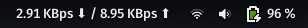

# GNOME Internet Speed Meter
A lightweight script to display real-time internet speed in your GNOME top bar. This project uses the [Executor GNOME Extension](https://extensions.gnome.org/extension/2932/executor/) to run the script and update the speed dynamically.



## Features

- Shows download and upload speeds in real-time
- Simple and easy to configure
- Works directly with the GNOME top bar

## Prerequisites

- [Executor Extension](https://extensions.gnome.org/extension/2932/executor/) installed and enabled

## Installation

1. **Install the Executor Extension:**

   - Visit the [Executor Extension page](https://extensions.gnome.org/extension/2932/executor/) and follow the instructions to install it.

2. **Clone the repository:**

   ```bash
   git clone https://github.com/ShivangSrivastava/speed_meter.git
   ```

3. **Make the script executable:**

   ```bash
   cd speed_meter
   chmod +x speed_meter.sh
   ```

4. **Configure Executor Extension:**

   - Open the Executor settings.
   - Add the following path to the Executor's command configuration:
     ```
     ./<:Your Path:>/speed_meter/speed_meter.sh
     ```

5. **That's it!** 🎉 Your internet speed meter should now be running in the GNOME top bar.

## Contributing

Feel free to open issues or submit pull requests with improvements, suggestions, or bug fixes.
